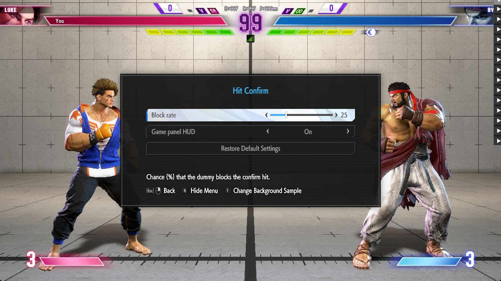
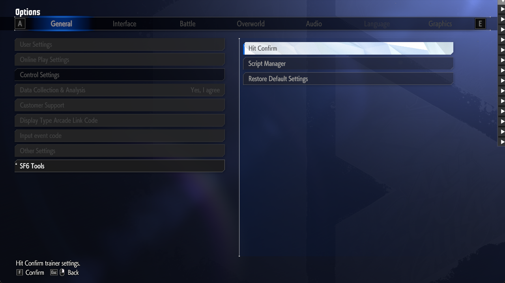
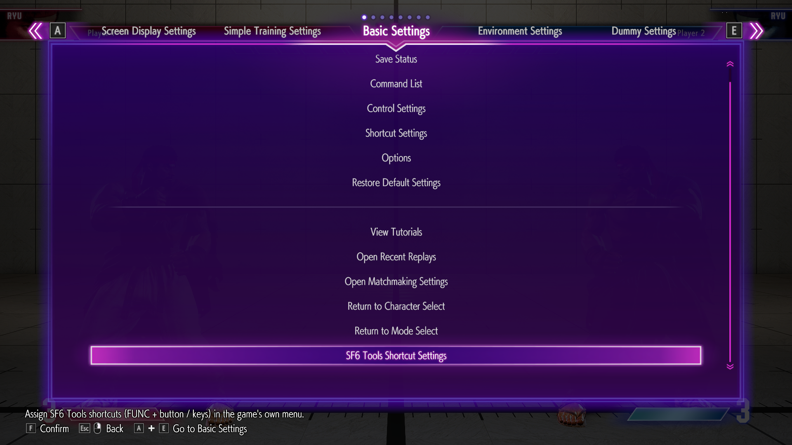
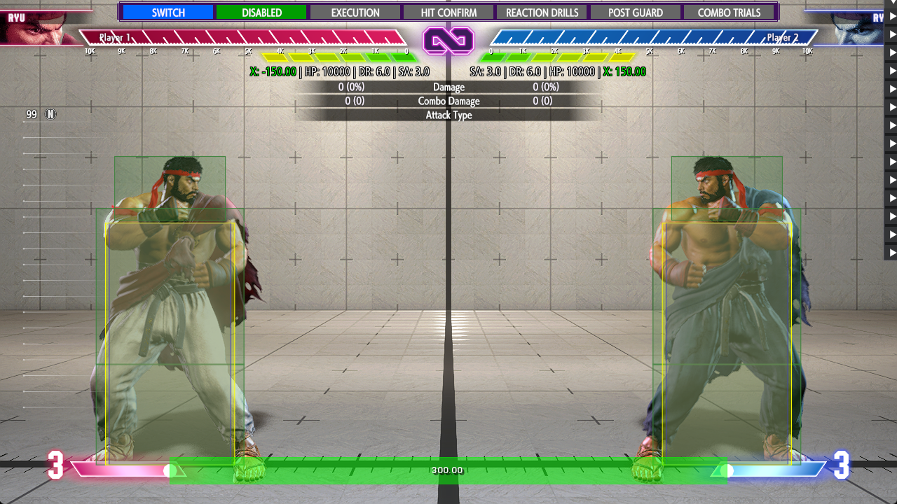
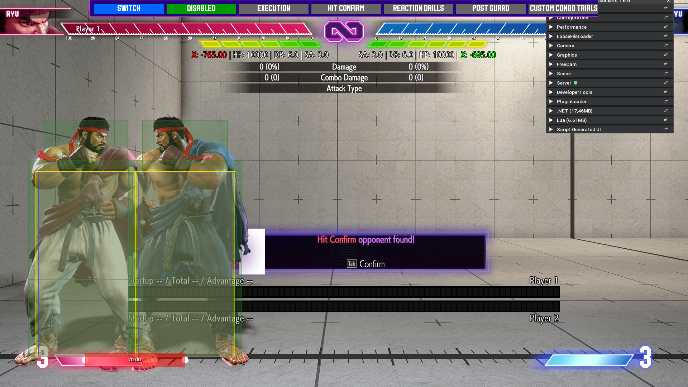

# Building Native In-Game Menus and HUD in Street Fighter 6 with REFramework

> **TL;DR** -- You can inject fully native settings windows, pause-menu rows and tabs, HUD panel
> text, and on-screen popups into SF6 Training Mode using only REFramework Lua -- no DLL patching,
> no custom rendering, no ImGui. The game builds the rows, handles focus/navigation, and draws
> everything with its own fonts, sprites, and nine-slice frames. This guide documents every
> technique we shipped, every crash that taught us a rule, and the probing workflow that found the
> entry points.

| | |
|---|---|
| **Reading time** | ~45 minutes (full); ~15 minutes (techniques 1-2 only) |
| **Skill level** | Intermediate REFramework Lua (you know `sdk.hook`, `sdk.find_type_definition`, `sdk.get_managed_singleton`) |
| **Game version** | Street Fighter 6, RE Engine (tested with REFramework-Websockets build LL5271; plain REFramework works for all menu techniques) |
| **Last updated** | 2026-08-31 |

[](img/native_window_hitconfirm.png)
*The "Hit Confirm" settings window, built entirely from the game's own Options dialog UI, displayed over the live fight with the combat paused.*

---

## 1. Who This Is For

You are a REFramework Lua modder who wants to add settings, overlays, or controls to SF6 Training
Mode **without** ImGui windows or D2D overlays. Maybe you want your mod's settings to look like
they belong in the game. Maybe ImGui is unreliable on your users' setups. Maybe you want
controller-navigable menus.

This guide covers five complementary techniques, from the most practical (Options dialog rows) to
the most experimental (hijacking the game's two-column Control Settings dialog). Each section is
self-contained: read only what you need.

**What you get:**
- A settings window that opens over the fight, pauses the action, and looks exactly like the
  game's own Options panels (sliders, toggles, spin-texts, buttons).
- Rows and entire tabs inside the training pause menu (spins, buttons, action callbacks).
- The game's own Damage / Combo Damage / Attack Type panel and round-timer digits driven by your
  script.
- Popup frames and text assembled from borrowed GUI elements (the "Match Found" neon frame, etc.).
- A workflow for discovering new menus and controls to hook.

---

## 2. Prerequisites

### REFramework

Any recent REFramework build for SF6 works for the menu techniques (1-5). The
[REFramework-Websockets build (LL5271)](https://github.com/praydog/REFramework) adds a Lua
websocket server on port 8080 which enables remote probing via scripts (section 10), but it is
not required for any of the UI injection itself.

### Lua Basics

You should be comfortable with:
- `sdk.find_type_definition`, `sdk.get_managed_singleton`, `sdk.create_instance`
- `sdk.hook(method, pre_fn, post_fn)` and the `PreHookResult.SKIP_ORIGINAL` pattern
- `re.on_pre_application_entry("LateUpdateBehavior", fn)` (game thread callbacks)
- `re.on_frame` (render thread) vs. the game thread -- this distinction is critical (Rule 1)
- `json.load_file` / `json.dump_file` for persistence

### Crash Reading Workflow

When SF6 crashes with REFramework loaded, check **two files** before relaunching (the log is
overwritten on restart):
1. `reframework/re2_framework_log.txt` -- scroll to the "Exception occurred" section for the
   stack trace and faulting address.
2. `reframework/reframework_crash.dmp` -- timestamp tells you which crash this is.

---

## 3. How the Game's UI Works

A brief map of the game's UI architecture, as far as is relevant to modding. All of this was
discovered by probing (section 10), not from any official documentation.

### Controls and Agents

SF6's UI is built on the RE Engine's `via.gui` control tree. Controls (`via.gui.Control` and its
subtypes -- `Rect`, `Text`, `Scale9Grid`, `Panel`) form a parent-child hierarchy. Each menu
screen has a **UIAgent** (`app.UIAgent`) that owns a control tree (accessible via
`agent.get_ControlMain()`). All live agents are listed in `app.UIAgentManager._Entries`.

Key agent names in Training Mode:
| Agent name | What it is |
|---|---|
| `ui11200` | Training pause menu (tabs, rows, focus management) |
| `OptionDialog` | The Options / Settings dialog (appears over the fight or from the pause menu) |
| `KeyConfigBattleMenuFG` | The "Control Settings" two-column dialog |
| `BattleHud_Timer` | Round timer (hosts the `c_main` control we borrow elements under) |
| `Resident_Cmn_MatchingStandby` | Matchmaking popup (source of neon frames and texts) |

### UIFlows and Params

Menu screens are managed by **UIFlows** (`app.UIFlowManager`). A flow is started with a static
`Start(...)` call that returns an `IUIFlowHandle`. The flow creates a `Param` object (its
operational state) and drives the screen through `Init` -> `ShowedObject` -> user interaction ->
`OnEnd`. The handle's `get_IsEnd()` tells you when the flow has finished.

Important flows:
| Flow class | Param class | What it drives |
|---|---|---|
| `app.UIFlowOptionBGDialog` | `app.UIFlowOptionBGDialog.Param` | The dark "BattleHud" options window (our main vehicle) |
| `app.UIFlowKeyConfig.Menu` | `app.UIFlowKeyConfig.Menu.Param` | The two-column Control Settings dialog |
| `app.UIFlowShortcutSetting` | (managed by `app.ShortcutSetting`) | The Shortcut Settings menu |

### UIParts

Rows inside menus are `UIParts` objects (`UIPartsSpin`, `UIPartsButton`, `UIPartsScrollList`,
`UIPartsGroupScroll`). The game instantiates them from a pool and binds them to data objects. You
rarely create UIParts directly; instead, you create the data objects (`OptionSettingUnit`,
`TrainingMenuData`) and let the game build the parts.

### Message GUIDs (hMsg)

Every displayed text in SF6's menus comes from a GUID lookup: `app.helper.hMsg.GetMessage(Guid)`.
The game stores its texts in message tables indexed by GUID. We cannot add entries to those tables,
so we hook `GetMessage` and intercept our own fake GUIDs, returning whatever string we want. This
is the foundation of every technique in this guide.

```lua
-- Create a GUID and register its text
local guid_text = {}   -- GUID string -> our text
local function message_guid(str)
    local g = sdk.find_type_definition("System.Guid"):get_field("Empty"):get_data(nil):NewGuid()
    guid_text[g:call("ToString()")] = str
    return g
end

-- Hook the message resolver
sdk.hook(
    sdk.find_type_definition("app.helper.hMsg"):get_method("GetMessage(System.Guid)"),
    function(args)
        local s = guid_text[sdk.to_valuetype(args[2], "System.Guid"):call("ToString()")]
        if s then
            thread.get_hook_storage()[1] = s
            return sdk.PreHookResult.SKIP_ORIGINAL
        end
    end,
    function(retval)
        local s = thread.get_hook_storage()[1]
        if s then return sdk.to_ptr(sdk.create_managed_string(s)) end
        return retval
    end
)
```

### Writing GUIDs to Objects

This REFramework build refuses direct assignment of nested `ValueType` fields (like
`obj.GuidField = guid`). You must write the 16 raw bytes:

```lua
local function set_guid(obj, field_name, guid)
    local off = obj:get_type_definition():get_field(field_name):get_offset_from_base()
    obj:write_qword(off, guid:read_qword(0))
    obj:write_qword(off + 8, guid:read_qword(8))
end
```

---

## 4. The Golden Rules (Crash-Proven)

Every rule below was learned from a crash -- most of them from access violations that took the
game down without a recoverable error. They are listed in order of severity.

### Rule 1: No Lua Off the Main Thread

**Symptom:** Intermittent AV (access violation) in random engine functions, 1-3 minutes after
loading. The REFramework menu being open masks the bug (it serialises Lua execution).

**Cause:** `sdk.hook` callbacks on methods that run on the game's input thread, UI job threads,
or the render thread. Specifically, hooks on `InputState` setters,
`UIWidget_TMAttackInfo.SetXText`, and `UIBattleHud_Timer.UpdateBattleHud` all ran Lua off the
main thread and caused non-deterministic crashes (bisected with `soak.py`: 0/3 crashes without,
3/3 with).

**Rule:** Every GUI write and every non-trivial Lua callback must happen on the game's main
thread: `re.on_pre_application_entry("LateUpdateBehavior", fn)`. Read-only hooks on the render
thread (`re.on_frame`) are acceptable for data collection, but **never write** to game objects
from there.

### Rule 2: Proof of Life Before Writing to Cached Objects

**Symptom:** AV in `set_Message`, `set_Color`, or `set_Visible` on a `via.gui.Text` or
`via.gui.Control` that was valid a few frames ago.

**Cause:** The game rebuilds its battle HUD on every change of `PauseManager._CurrentPauseTypeBit`
(our window's pause type 8, the real pause menu, option dialogs...). Every cached control may be
freed, and `sdk.is_managed_object` can return `true` on a **reallocated** chunk (measured 31/08:
crash with guards in place). During pause/HUD transitions, cached controls are not just invalid
-- the memory may be reused for a different object.

**Rule:**
1. Call `sdk.is_managed_object(control:get_address())` before every write -- but know it is not
   perfect.
2. **Drop all caches** (panel, timer, texts) the moment `TrainingGamePaused` or
   `NativeOptionsWindowOpen` becomes true. Do not attempt any "last write" -- the controls may
   already be freed.
3. Monitor `_CurrentPauseTypeBit`: on any change, drop all caches and wait 20 ticks before
   resolving new controls.
4. Wrap every GUI write in `pcall`. A single unprotected AV is fatal.

### Rule 3: Never Re-Populate an Open Dialog Page

**Symptom:** RIP 0 (null function pointer dereference) in the UI parts pool, a few frames after
you mutated a `ChildUnitList` on a unit whose dialog page is currently displayed.

**Cause:** `SetupDispUnits` binds UIParts from a pool to your data. If you change the data types
(e.g., replace a slider with a button) while the page is live, the pool rebinds parts of the
wrong type, and the next layout call jumps through a null vtable entry.

**Rule:** Never call `SetupDispUnits` or mutate `ChildUnitList` while a dialog page is open.
Instead: `End()` the dialog, wait for the agent to vanish, `rebuild()` the data tree, then
`Start()` a new dialog. With `ImmediateFade = true` (section 5), this transition is visually
instant even under a held pause.

### Rule 4: Never Fabricate Game Data Objects the Engine Expects Fully Built

**Symptom:** `NullReferenceException` inside `SetSettingParams` or `MakeListIndexToParamIndex`,
followed by `IndexOutOfRangeException` in `UpdateListSetting`, game dies a few frames later.

**Cause:** Creating `app.UIKeyConfig.SettingParam` via `sdk.create_instance` and filling only the
integer fields. The engine methods expect the `Name`, `Icon`, `Comment` string properties and the
`GamePadButton` enum to be fully initialised. Half-built params crash the list construction.

**Rule:** When a game type has complex initialisation, **clone** an existing instance
(`CloneSettingParams`, `MemberwiseClone`) instead of fabricating one. Override only the text
getters via hooks. This is how `NativeDialog` works (section 9).

### Rule 5: pcall(func, args), Not pcall(function() ... end)

**Symptom:** Gradually increasing memory usage (1-3 MB/minute), eventually causing stutter.

**Cause:** `pcall(function() ... end)` allocates a new closure on every call. On hot paths (60
calls/second), these closures accumulate faster than the GC collects them.

**Rule:** Use `pcall(func, arg1, arg2)` with a pre-defined function. 89 hot-path closure calls
were fixed in the SF6 Tools codebase in one pass.

### Rule 6: io.open Is Relative to reframework/data/, Never Use ".."

**Symptom:** `io.open` fails silently or writes to an unexpected location.

**Cause:** REFramework sandboxes `io.open` to `reframework/data/`. Paths with `..` are rejected.
`io.popen` and `os.execute` are blocked entirely.

**Rule:** Use `json.dump_file` for JSON (it handles Windows file locks). Use `io.open` only for
text files, always with paths relative to `reframework/data/` (no `data/` prefix in the path).

### Rule 7: fs.glob Is Expensive -- Never On a Timer

**Symptom:** Frame-time spikes of ~260 ms every N seconds.

**Cause:** `fs.glob` walks the entire `reframework/data/` tree (~2200 files). Calling it
periodically (e.g., to refresh a file list) creates regular hitches.

**Rule:** Call `fs.glob` only when a menu is about to open (the user expects a brief pause).
Cache the result. In `NativeOptions`, the `lists_changed()` check and `rebuild()` happen in the
`open_request` path, not on a timer.

### Rule 8: GUI Writes Only from LateUpdateBehavior

**Symptom:** AV in `set_Message` when called from `re.on_frame`.

**Cause:** `re.on_frame` runs on the **render thread**. Writing to `via.gui.Text.set_Message`
from there races with the game's own layout pass on the main thread.

**Rule:** `set_Message`, `set_Color`, `set_Visible`, `set_Position`, `set_Size` -- all of these
must be called from `re.on_pre_application_entry("LateUpdateBehavior", ...)` or from a
`sdk.hook` callback on a method known to run on the main thread (e.g., `TrainingManager.OpenMenu`).

### Rule 9: Never Modify Game Texts at the Source

**Symptom:** Crash or permanent text corruption after a training reset.

**Cause:** Overwriting the `Message` field of a control the game owns means the game's own
updates read back your text and treat it as the original.

**Rule:** Write to controls you have **claimed** and restore the original when you release them.
Store originals on disk (they survive script reloads). For the HUD panel, the "side" texts
(`LeftText`, `RightText`) are rewritten by the widget every frame -- hide them and use only the
center text.

---

## 5. Technique 1 -- Options Dialog Rows (NativeOptions)

This is the primary technique: injecting settings rows into the game's own Options system and
opening them as a standalone window over the live fight. The game builds the toggles, sliders,
spin-texts, and buttons; handles d-pad/stick navigation; and renders everything with its own
style.

[](img/options_sf6tools_submenu.png)
*"SF6 Tools" appears at the bottom of Options > General. Expanding it shows sub-groups (Hit Confirm, Script Manager), each of which opens a BattleHud-style window over the fight.*

[](img/native_window_hitconfirm.png)
*The "Hit Confirm" window with a slider, a toggle, and a button, opened over the paused fight.*

### How It Works

1. **Create `OptionSettingUnit` entries** and attach them to `app.OptionManager.UnitLists[General]`.
   The game's Options screen reads this list to build the "General" tab. A unit with
   `EventType.OpenSubMenu` becomes a clickable group; a unit with `EventType.OpenBattleHudSetting`
   opens a "BattleHud"-style dark window.
2. **Resolve texts via fake GUIDs**: every `TitleMessage` and `DescriptionMessage` is a GUID. We
   generate random GUIDs and hook `hMsg.GetMessage` to return our strings.
3. **Skip the game's Load/Reset**: hook `OptionValueUnit.LoadValueEvent` and `ResetEvent` to
   skip our TypeIds (the game must not try to load or reset values it does not own).
4. **Open a window over the fight**: call `UIFlowOptionBGDialog.Start(SettingData, false)` from
   `LateUpdateBehavior`. The `SettingData.TopUnit` points to one of our group units.
5. **Pause the fight**: `PauseManager.requestPause(true, 8)` (type 8 = `BATTLE_MENU_PAUSE`, the
   same type the real pause menu uses). Release it when the window closes.

### Step-by-Step: Adding a Settings Group

#### Step 1: Allocate TypeIds

Every `OptionSettingUnit` needs a unique `TypeId`. The game caches widget kinds by TypeId across
script reloads, so you must use fresh IDs each time your script loads:

```lua
local next_id = nil
local function new_id()
    if not next_id then
        -- Find the highest existing TypeId in the game's ValueType enum
        local max = 0
        for _, f in ipairs(sdk.find_type_definition("app.Option.ValueType"):get_fields()) do
            if f:is_static() then
                local ok, v = pcall(f.get_data, f, nil)
                if ok and type(v) == "number" and v > max and v < 2100000000 then max = v end
            end
        end
        next_id = math.ceil((max + 1) / 10) * 10 + 100000
        next_id = next_id + (os.time() % 5000) * 100   -- fresh per load
    end
    next_id = next_id + 1
    return next_id
end
```

#### Step 2: Build the Unit Tree

```lua
local InputType = enum("app.Option.UnitInputType")     -- SpinText, Slider, Button_Type1, Button_Type2
local EventType = enum("app.Option.DecideEventType")   -- OpenSubMenu, OpenBattleHudSetting, SettingReset, ...
local DataType  = enum("app.Option.SettingDataType")   -- Value
local TabType   = enum("app.Option.TabType")           -- General

local mgr = sdk.get_managed_singleton("app.OptionManager")
local parent_list = mgr.UnitLists:call("get_Item", TabType.General)

-- Get empty typed lists from an existing unit (for MemberwiseClone)
local first_setting = parent_list:call("get_Item", 0):call("get_Setting")
local empty_guids    = first_setting.ValueMessageList:call("GetRange", 0, 0)
local empty_settings = first_setting.ChildUnitList:call("GetRange", 0, 0)
```

#### Step 3: Create the Root Group

```lua
local function new_setting()
    local d = sdk.create_instance("app.Option.OptionSettingUnit")
    d.TypeId = new_id()
    return d
end

local function make_unit(desc, description, value_messages)
    local unit = desc:call("MakeUnitData")
    local s = unit:call("get_Setting")
    set_guid(s, "DescriptionMessage", message_guid(description or ""))
    s.ValueMessageList = empty_guids:call("MemberwiseClone")
    s.ChildUnitList    = empty_settings:call("MemberwiseClone")
    for _, msg in ipairs(value_messages or {}) do
        s.ValueMessageList:call("Add", message_guid(msg))
    end
    return unit
end

-- Root: "My Mod" -> opens a sub-menu
local root_desc = new_setting()
set_guid(root_desc, "TitleMessage", message_guid("My Mod"))
root_desc.InputType = InputType.Button_Type1
root_desc.EventType = EventType.OpenSubMenu
local root_unit = make_unit(root_desc, "Settings for My Mod.")
parent_list:call("Add", root_unit)
```

#### Step 4: Add a Settings Sub-Group (Opens a Window)

```lua
local group_desc = new_setting()
set_guid(group_desc, "TitleMessage", message_guid("My Settings"))
group_desc.InputType = InputType.Button_Type1
group_desc.EventType = EventType.OpenBattleHudSetting   -- opens a window over the fight
local group_unit = make_unit(group_desc, "Adjust my mod's parameters.")

-- Attach to root
local function attach(parent, child)
    parent:call("get_ChildUnits"):call("Add", child)
    parent:call("get_Setting").ChildUnitList:call("Add", child:call("get_Setting"))
end
attach(root_unit, group_unit)
```

#### Step 5: Add a Toggle (SpinText with Off/On)

```lua
local toggle_desc = new_setting()
set_guid(toggle_desc, "TitleMessage", message_guid("Enable Feature"))
toggle_desc._DataType   = DataType.Value
toggle_desc.InputType   = InputType.SpinText
local toggle_type_id = toggle_desc.TypeId

local toggle_unit = make_unit(toggle_desc, "Turn the feature on or off.", {"Off", "On"})
attach(group_unit, toggle_unit)

-- Value setting (min/max/initial)
local vs = sdk.create_instance("app.Option.OptionValueSetting")
vs.TypeId = toggle_type_id
vs.MinValue = 0; vs.MaxValue = 1; vs.InitValue = 1   -- default "On"
toggle_unit:call("set_PrevValue", 1)
toggle_unit:call("set_ValueSetting", vs)
toggle_unit.ValueData = vs:call("MakeValueData")
```

#### Step 6: Add a Slider

```lua
local slider_desc = new_setting()
set_guid(slider_desc, "TitleMessage", message_guid("Block Rate"))
slider_desc._DataType = DataType.Value
slider_desc.InputType = InputType.Slider

local slider_unit = make_unit(slider_desc, "Chance (%) that the dummy blocks.")
attach(group_unit, slider_unit)

local svs = sdk.create_instance("app.Option.OptionValueSetting")
svs.TypeId = slider_desc.TypeId
svs.MinValue = 0; svs.MaxValue = 100; svs.InitValue = 50
slider_unit:call("set_PrevValue", 50)
slider_unit:call("set_ValueSetting", svs)
slider_unit.ValueData = svs:call("MakeValueData")
```

#### Step 7: Add a Button (Restore-Row Pattern)

Buttons use `InputType.Button_Type2` and `EventType.SettingReset` -- the exact pattern of the
game's "Restore Default Settings" row. This renders as a full-width centred button.

```lua
local btn_desc = new_setting()
set_guid(btn_desc, "TitleMessage", message_guid("START SESSION"))
btn_desc.InputType = InputType.Button_Type2
btn_desc.EventType = EventType.SettingReset
local btn_unit = make_unit(btn_desc, "Start the training session.")
attach(group_unit, btn_unit)
```

> **Note:** `Button_Type1` renders the title left-aligned when focused (used for sub-menu
> navigation). `Button_Type2` keeps the title centred (used for action buttons). Always use
> `Type2` for buttons in your settings window.

To handle button presses, hook `Param.GetFocusDecideEventType` and
`Param.FlowEvent_ResetCurrentUnits`:

```lua
local bg_param_td = sdk.find_type_definition("app.UIFlowOptionBGDialog.Param")

-- Intercept the decide: return Invalid (0) for our buttons so no "Revert?" popup appears
sdk.hook(bg_param_td:get_method("GetFocusDecideEventType"), function(args)
    thread.get_hook_storage()["param"] = args[2]
end, function(rv)
    if (sdk.to_int64(rv) & 0xFF) == 1 then   -- SettingReset
        local param = sdk.to_managed_object(thread.get_hook_storage()["param"])
        local u = param:call("GetFocusUnit")
        local tid = u and u:call("get_Setting").TypeId
        if tid == btn_desc.TypeId then
            -- Queue your callback here
            my_button_callback()
            return sdk.to_ptr(0)   -- DecideEventType.Invalid: no popup
        end
    end
    return rv
end)
```

#### Step 8: Skip Load/Reset for Our IDs

```lua
local known_ids = { [toggle_type_id] = true, [slider_desc.TypeId] = true, [btn_desc.TypeId] = true }

local function skip_ours(args)
    local ok, id = pcall(function()
        return sdk.to_managed_object(args[2]):call("get_Setting").TypeId
    end)
    if ok and known_ids[id] then return sdk.PreHookResult.SKIP_ORIGINAL end
end

local vu = sdk.find_type_definition("app.Option.OptionValueUnit")
sdk.hook(vu:get_method("LoadValueEvent"), skip_ours)
sdk.hook(vu:get_method("ResetEvent"), skip_ours)
```

#### Step 9: Open the Window Over the Fight

```lua
local dialog_handle = nil

local function open_window()
    -- Close any existing dialog first (they stack)
    if dialog_handle then
        pcall(function()
            if not dialog_handle:call("get_IsEnd") then dialog_handle:call("End") end
        end)
    end

    local sd = sdk.create_instance("app.UIFlowOptionBGDialog.SettingData")
    sd.TopUnit = group_unit
    sd.SupportMode = 32
    sd.UseBattleHudBG = false
    sd.PlayerIndex = 0

    local m = sdk.find_type_definition("app.UIFlowOptionBGDialog")
        :get_method("Start(app.UIFlowOptionBGDialog.SettingData, System.Boolean)")
    dialog_handle = m:call(nil, sd, false)
end
```

Call `open_window()` from `LateUpdateBehavior` when your hotkey is pressed or your pause-menu
button is activated. **Never from `re.on_frame`** (Rule 8).

#### Step 10: Pause the Fight

```lua
local PAUSE_TYPE = 8   -- BATTLE_MENU_PAUSE
local pause_held = false

local function hold_pause(on)
    if on == pause_held then return end
    local mgr = sdk.get_managed_singleton("app.PauseManager")
    if mgr and pcall(function() mgr:call("requestPause", on, PAUSE_TYPE) end) then
        pause_held = on
    end
end
```

Call `hold_pause(true)` right after `open_window()`. Call `hold_pause(false)` when the dialog
closes (detected via `dialog_handle:call("get_IsEnd")` or the `OptionDialog` agent vanishing).

#### Step 11: Detect Closure

Poll from `LateUpdateBehavior` every ~10 ticks:

```lua
if dialog_handle then
    local ended = pcall(function() return dialog_handle:call("get_IsEnd") end)
        and dialog_handle:call("get_IsEnd")
    if ended then
        dialog_handle = nil
        hold_pause(false)
    end
end
```

#### Step 12: Poll for Value Changes

```lua
-- In LateUpdateBehavior, every ~10 ticks:
local ok, n = pcall(function() return toggle_unit:call("get_Value") end)
if ok and n ~= last_toggle_value then
    last_toggle_value = n
    local is_on = (n ~= 0)
    -- Act on the change
end
```

### Mutual Exclusion with the Pause Menu

The Esc/Start button that closes your window also reaches the training pause menu via
`TrainingManager.OpenMenu`. Hook it to skip while your window is open (and for ~20 frames after):

```lua
local tm_td = sdk.find_type_definition("app.training.TrainingManager")
local open_menu = tm_td:get_method("OpenMenu(app.training.TrainingManager.MenuType, app.training.BaseParam)")
sdk.hook(open_menu, function(args)
    if my_window_open or (tick - closed_tick) < 20 then
        return sdk.PreHookResult.SKIP_ORIGINAL
    end
end, function(rv) return rv end)
```

### Skipping the Screen Fade (ImmediateFade)

When you close and reopen the dialog (e.g., to refresh the content after a mode change), the
default transition includes a screen fade. Under a held pause, that fade freezes (the fade
animation needs unpaused frames). To skip it:

```lua
sdk.hook(bg_param_td:get_method("CreatedObject"), function(args)
    if my_window_open then
        pcall(function()
            local param = sdk.to_managed_object(args[2])
            param:set_field("<ImmediateFade>k__BackingField", true)
        end)
    end
end, function(rv) return rv end)
```

### Hiding the Game's "Restore Default Settings" Row

When your window opens, the game auto-adds a "Restore Default Settings" row. On our pages (where
it would reset nothing), hide it:

```lua
sdk.hook(bg_param_td:get_method("SetupDispUnits"), function(args)
    thread.get_hook_storage()["param"] = args[2]
end, function(rv)
    pcall(function()
        local param = sdk.to_managed_object(thread.get_hook_storage()["param"])
        local parts = param:get_field("OptionUnits")
        if not parts then return end
        local ours = false
        local reset_parts = {}
        for i = 0, parts:call("get_Length") - 1 do
            local part = parts:call("GetValue", i)
            local ud = part and part:get_field("UnitData")
            if ud then
                local s = ud:call("get_Setting")
                if known_ids[s.TypeId] then
                    ours = true
                elseif s.EventType == 1 then   -- SettingReset (the game's own)
                    reset_parts[#reset_parts + 1] = part
                end
            end
        end
        if ours then
            for _, part in ipairs(reset_parts) do
                local c = part:call("get_Control")
                if c then c:call("set_ForceInvisible", true) end
                pcall(function() part:call("SetDisable", true) end)
            end
        end
    end)
    return rv
end)
```

### Dynamic Lists and Refresh

If your options include a file list (e.g., recording slots), re-read it only when the window is
about to open -- never on a timer (Rule 7). The pattern:

1. Before opening, check if any `options_fn` (a function returning a list) has changed.
2. If it has, tear down the unit tree (`parent_list:Remove(root_unit)`) and rebuild it.
3. Open the new window.

### Cleanup on Script Reset

```lua
re.on_script_reset(function()
    if root_unit and parent_list then
        pcall(function() parent_list:call("Remove", root_unit) end)
    end
end)
```

### NativeOptions API Reference

The `NativeOptions.lua` module wraps all of the above into a clean API:

| Function | Description |
|---|---|
| `Opt.group(title, desc, {mode=id, key=key})` | Create a named settings group. `mode` links it to a trainer mode ID. |
| `g:toggle(key, title, desc, default, cb, opts)` | Boolean toggle (Off/On spin). `cb(value)` fires on change. |
| `g:choice(key, title, desc, options, default, cb, opts)` | Spin with named options. `default` and `cb` value are 1-based. `options` may be a function. |
| `g:slider(key, title, desc, min, max, default, cb, opts)` | Integer slider. |
| `g:button(key, title, desc, cb, refresh)` | Action button. `cb()` may return `"close"` to dismiss the window. `refresh=true` rebuilds the window after the press (for dynamic titles). |
| `g:get(key)` / `g:set(key, v)` | Read/write an entry's value programmatically. |
| `Opt.open(title)` | Open the named group's window over the fight (if not paused). |
| `Opt.open_after_unpause(title)` | Queue an open that waits for the fight to be back for 5 stable ticks. |
| `Opt.close()` | Close the current window. |
| `Opt.set_mode_selector(names, ids, get, set)` | Install a "Training mode" spin at the top of the composite "SF6 Tools" window. |
| `Opt.rebuild()` | Tear down and rebuild the unit tree (for dynamic content). |
| `Opt.message_guid(str)` | Create a fake GUID resolved to `str` (reusable by other modules). |

Options for entries (`opts` table):
- `deferred = true` -- callback fires only after the window closes and the fight resumes (for
  heavy operations like recording import).
- `getter = function()` -- called at window open to refresh the entry's value from external state.

---

## 6. Technique 2 -- Pause Menu Rows and Tabs (NativePauseMenu)

Inject rows into the training pause menu's "Basic Settings" tab and add entirely new tabs.

[](img/pause_menu_injected_row.png)
*The "SF6 Tools Shortcut Settings" row at the bottom of Basic Settings, with the scroll indicator. An extra tab dot is visible at the top (our "SF6 Tools" tab).*

### How It Works

The training pause menu is driven by `TrainingManager._UIData._MenuData`, a
`TrainingMenuData[8]` array (one per tab). Each tab's rows are in `_ChildData` (static) and
`DynamicChildData` (dynamic, added at runtime). The game provides `AddDynamicMenu(funcType,
data, action)` to append rows.

Our rows use `FuncType = 345` (the `DYNAMIC` value we chose; the game's own tabs use 1..8). The
game calls `TrainingMenuFunc` methods to render and interact with them:

| Method | When | What we do |
|---|---|---|
| `ViewUpdate(param, data, i)` | Per row, each frame | Remember which of our rows is being processed (`current = item`) |
| `GetIsActive(ftype)` | Per row | Return `1` (active) |
| `GetOptionText(ftype)` | Per spin row | Return the current option's text |
| `GetOptionIndex(ftype, wanted, ftype)` | On spin change | Call `item.set(wanted)`, return `wanted` |
| `Function(ftype, param, viewData, value)` | On confirm/decide | For buttons: call `item.on_decide()`, return 0 (stay) or 1 (close menu) |

Rows are identified by their `TrainingMenuData` address via the `_MessageID` GUID (because
`AddDynamicMenu` clones the data -- original addresses are lost).

### Adding a Spin Row

```lua
local PM = require("func/NativePauseMenu")

PM.spin(
    "Training mode",                           -- title
    "Which training script drives the dummy.", -- guide text (bottom of screen)
    { "DISABLED", "HIT CONFIRM", "REACTION DRILLS" },  -- options
    function() return current_mode_index end,  -- getter (0-based)
    function(i) set_mode(i) end                -- setter (0-based)
)
```

### Adding a Button Row

```lua
PM.button(
    "SF6 Tools Shortcut Settings",
    "Open the shortcut configuration menu.",
    function() NativeShortcuts.open() end,   -- on_decide
    true,   -- keep_open: the pause menu stays up
    true    -- in_tab: also appears in our "SF6 Tools" tab
)
```

### Adding a Complete Tab (Page)

```lua
local pg = PM.page("Distance Viewer", "Distance Viewer settings.")

pg:toggle("Display P1", "Show P1 distance overlay.",
    function() return config.p1_enabled end,
    function(v) config.p1_enabled = v; save() end)

pg:spin("Red Zone", "Attack used for the red zone.",
    function() return get_move_names() end,   -- options (function = dynamic list)
    function() return selected_move_index end,
    function(i) select_move(i) end,
    20)  -- capacity: max option count (row built once, options filled live)

pg:button("TELEPORT", "Move both players to this distance.",
    function() teleport() end,
    false)  -- keep_open = false: closes the pause menu after the action

pg:value("Distance", "Current distance between players.",
    function() return string.format("%.1f", current_distance) end)

pg:label("Press L1+R1 to toggle overlay.", "Keyboard: F5.")
```

### The Tab Installation

Tabs are installed by replacing `_MenuData` with a longer array (the game's 8 + our tabs). Each
of our tabs is a `TrainingMenuData` with `_FuncType = 345` and `_ChildData` = our row objects.
The game renders the tab in the strip, shows its page dot, and handles focus/navigation.

Installation happens with the menu **closed** (Rule 3). `NativePauseMenu` checks `tabs_present`
every 60 ticks and reinstalls if the game rebuilt its menu data (character change, etc.).

### The 14-Row Scroll Bug

The Basic Settings tab has 13 stock rows. Adding one makes 14, which lands **exactly** at the
bottom of the scroll view (`_ViewTop 37.5 + _ViewSize.h 805 = 842.5 = bottom of row 13`). But
the visual mask sits 20 px higher, so the game never scrolls and the last row is clipped.

**Fix:** Write `_ViewSize.h = 745` to `UIPartsGroupScroll` (the `ui11200` agent's root item)
during the pause. One fewer row in the view, and the game's own `ScrollFocusItem` scrolls to it.
A 13-row tab still fits (equality = visible).

```lua
-- In LateUpdateBehavior, while paused:
local mgr = sdk.get_managed_singleton("app.UIAgentManager")
local list = mgr:get_field("_Entries")
for i = 0, list:call("get_Count") - 1 do
    local agent = list:call("get_Item", i).Agent
    local go = agent and agent:call("get_GameObject")
    if go and tostring(go:call("get_Name")) == "ui11200" then
        local root = agent:get_field("_RootItem")
        if root then
            local off = root:get_type_definition():get_field("_ViewSize"):get_offset_from_base()
            if root:read_float(off + 4) > 745 then
                root:write_float(off + 4, 745)
            end
        end
        break
    end
end
```

### Dynamic Titles

Titles and guides given as **functions** are re-evaluated in a pre-hook on
`TrainingManager.OpenMenu` (the single entry point for the pause menu, running on the game
thread). The hMsg hook then resolves the GUIDs to the fresh texts.

### NativePauseMenu API Reference

| Function | Description |
|---|---|
| `PM.spin(title, guide, options, get, set)` | Add a spin row to Basic Settings. `get`/`set` are 0-based. |
| `PM.button(title, guide, on_decide, keep_open, in_tab)` | Add a button row. `in_tab=true` duplicates it in the "SF6 Tools" tab. |
| `PM.page(title, guide, opts)` | Create a new tab page. Returns a `Page` object. `opts.tab=false` = container only, no tab installed. |
| `pg:spin(title, guide, options, get, set, capacity)` | Spin row on a page. `options` may be a function. |
| `pg:toggle(title, guide, get, set)` | Off/On toggle on a page. |
| `pg:number(title, guide, min, max, step, get, set, fmt)` | Numeric row with discrete steps. |
| `pg:button(title, guide, on_decide, keep_open)` | Button row on a page. |
| `pg:value(title, guide, fn)` | Read-only row whose text comes from `fn()`. |
| `pg:label(title, guide)` | Static text row. |
| `PM.tab_button(title, guide, on_decide, keep_open)` | Button in the "SF6 Tools" tab only. |

### Limits

- **Row pool:** the game creates ~20 UIParts per tab. More rows than the pool can handle will not
  render. Keep pages to **13 rows or fewer** (the game's own tabs never exceed 13).
- **Tab strip:** the game's tab strip is visually designed for 8 tabs. Adding 1-2 works cleanly
  (dots, focus, navigation all work); more than ~3 extras may crowd the strip.

---

## 7. Technique 3 -- Driving the Game's HUD (NativeHud)

Replace the training HUD's "Damage / Combo Damage / Attack Type" panel text and the round-timer
digits with your own content, using the game's own fonts, sprites, and layout.

[](img/native_hud_panel.png)
*The training HUD with the native damage panel (top centre) showing "Damage", "Combo Damage", and "Attack Type" labels. The round timer shows "99" with native digit sprites.*

### The Damage Panel

The widget `app.training.UIWidget_TMAttackInfo` (found via
`TrainingManager._ViewUIWigetDict`) has an `AttackInfos` array of 3 rows. Each row has
`LeftText`, `CenterText`, and `RightText` (`via.gui.Text` controls).

**Key insight:** The game rewrites the **side** texts (`LeftText`, `RightText`) every frame. You
cannot fight it. Instead, **hide** the side texts (`set_Visible(false)`) and write only the
**center** text -- which the game touches only on hit/guard events (and you re-assert yours on
the next tick).

```lua
local NativeHud = require("func/NativeHud")

-- Take ownership
NativeHud.claim("my_mod")

-- Write three rows (l/c/r parts are joined into the centre text with spacing)
NativeHud.set(0, "l", "SCORE: 3")
NativeHud.set(0, "c", "HIT CONFIRM")
NativeHud.set(0, "r", "TOTAL: 10")
NativeHud.set(0, "c", nil, 0xFF00FF00)   -- green colour (ABGR)

NativeHud.set(1, "l", "HIT: 80%")
NativeHud.set(1, "r", "BLOCK: 20%")

NativeHud.set(2, "c", "WAITING")

-- Give it back when done
NativeHud.release("my_mod")
```

### The Round Timer

`app.UIBattleHud_Timer` has digit sprite controls (`e_texture_number_001`, `010`, `100`) driven
by `set_UVPatternNo(digit)`. The infinity sign is `c_infinite` (hidden via `set_ForceInvisible`
while we drive the digits).

```lua
NativeHud.set_timer(29, 0xFF0000FF)   -- show "29" in red
NativeHud.set_timer(nil)               -- give the timer back
```

For numbers >= 100, the module adjusts the sprite positions and scale (the game only uses two
digits normally).

### Critical Safety (The Four AV Rules)

These four rules each correspond to a bisected crash on 30-31/08/2026:

1. **No GUI writes when paused** -- when `TrainingGamePaused` or `NativeOptionsWindowOpen`
   becomes true, drop all caches silently. Do not attempt a "farewell write."
2. **Restore texts only at `OpenMenu` pre-hook** -- this is the only point where the HUD controls
   are guaranteed alive (before the teardown that follows).
3. **Monitor `_CurrentPauseTypeBit`** -- any change triggers a HUD rebuild. Drop all caches and
   wait 20 ticks.
4. **`sdk.is_managed_object` is not enough** -- it passes on reallocated memory chunks. Always
   wrap GUI writes in `pcall`.

### NativeHud API Reference

| Function | Description |
|---|---|
| `NativeHud.claim(name)` | Take the HUD. Only one owner at a time. |
| `NativeHud.release(name)` | Give everything back (original texts restored). |
| `NativeHud.set(row, col, text, color)` | Set text/colour. `row` = 0-2, `col` = "l"/"c"/"r", `color` = ABGR. |
| `NativeHud.clear()` | Clear all pending text. |
| `NativeHud.set_timer(n, color)` | Drive the timer digits (0-999). `nil` restores the game's timer. |
| `NativeHud.request_text_visible(bool)` | Show/hide the panel texts (for modes that do not use the HUD). |
| `NativeHud.available()` | True when the panel controls are resolved. |

---

## 8. Technique 4 -- Borrowing GUI Elements (NativePopup)

Build on-screen popups, bars, and frames from the game's own `via.gui` elements -- without
creating any. This technique was used for the NativeTopBar (mode buttons across the top),
NativeBottomBar (action buttons at the bottom, now disabled), and NativePopup (notification
frames).

[](img/borrowed_popup.png)
*A popup assembled from borrowed GUI elements: the "Match Found" neon frame (Scale9Grid), a dark Rect body, and text elements from dormant agents.*

### Why Not Create Elements?

- `sdk.create_instance("via.gui.Text")` renders under the right parent and root, but **does not
  survive a script reset** (REFramework frees its managed instances, creating a dangling child
  that crashes on `set_Message`).
- `Panel:call("create_instance", ...)` and `control:call("duplicate")` do not render from Lua
  (the engine requires a registration step we cannot trigger).
- Only elements the **engine itself built** (from prefabs, during agent init) have the full
  internal state needed to render.

### The Recipe

1. **Find spare elements** the engine built but never displays in your game mode. Resident
   matchmaking agents (`Resident_Cmn_MatchingStandby`, `Resident_Cmn_MatchingSelect`, etc.) have
   hidden children (Battle Hub skins, online-standby skins) that are loaded but invisible in
   Fighting Ground.
2. **Copy the look** from a visible source: `source:call("copyProperties", spare)`. This copies
   the nine-slice atlas, font slot, glow parameters, and colour setup.
   > **Warning:** The direction is `SOURCE -> TARGET` (the source's properties are copied **onto**
   > the spare). Getting this backwards silently corrupts the source.
3. **Re-parent under a live host**: `host:call("addChild", spare)`. The host must be visible and
   in the render tree. `BattleHud_Timer`'s `c_main` is a good choice (it is always present in
   Training Mode and has font slot 8 available).
4. **Drive position, size, colour, priority** from `LateUpdateBehavior`.

### What Works and What Does Not

| Operation | Result |
|---|---|
| `addChild` a Rect from one agent to another | Works (if not already a child elsewhere; `remove()` + `addChild` if needed) |
| `addChild` a Text | Works **once**. `remove()` on a Text strips its font registration permanently -- it becomes a blank rectangle. Only move a Text once. |
| `addChild` a Scale9Grid | Works. `remove()` strips the atlas. Move only once. |
| `copyProperties` Scale9Grid -> Scale9Grid | Works. Copies the nine-slice atlas, border rects, and rendering mode. |
| `copyProperties` Text -> Text | Works. Copies font slot, outline, glow settings. |
| Setting `MaskType = 0` | Required. A borrowed control may carry a mask from its original parent that would clip the entire host. |
| Setting `ControlPoint = 5` | Centre anchor (simpler positioning). |

### The Bottom-Bar Failure and Lessons

The NativeBottomBar (action buttons at the bottom of the screen) was built and worked, but is
**disabled** (`NativeBottomBar_Experimental = true` to enable). Problems:

1. **Text pool too small.** Only ~4 Text elements across all resident agents survive adoption
   without crashing on `set_Message`. The bottom bar needs one text per button.
2. **Texts get rewritten by their original widget.** `BattleHud_HitCount/e_txt_score` renders
   fine after adoption, but `set_Message` throws an AV. `BattleHud_MatchWonNumber` texts get
   overwritten during combos (workaround: re-assert labels every 60 ticks).
3. **Script reset frees sdk.create_instance texts.** Even with `add_ref()`, the engine's GC
   or REFramework's cleanup frees created text instances, leaving dangling children under the
   host.

**Lesson:** Borrowed-element UIs are viable for small pieces (a popup with 1-3 lines, a top bar
with fixed labels) but do not scale to dynamic multi-button bars. For settings UI, use Techniques
1 and 2 instead.

---

## 9. Technique 5 -- Reusing Whole Game Menus (NativeShortcuts, NativeDialog)

### A. Shortcut Settings Menu Swap (NativeShortcuts)

The game's Shortcut Settings menu (`app.ShortcutSetting`) displays controller/keyboard bindings
from two data lists: `_SettingUserData.Data` (definitions) and `SettingSaveData.ItemDataList`
(state). By **swapping** both lists for our own while the menu is open, we get a fully functional
key-binding menu with our rows.

**How it works:**
1. Build `ShortcutSettingData` and `ShortcutSettingItemSaveData` arrays for our actions.
2. Before `ShortcutSetting.Start(0)`, swap the engine's lists for ours.
3. Block `ShortcutSaveData.Save` and `ShortcutSetting.Save` while swapped (the game must not
   persist our rows as real shortcuts).
4. On menu close (`get_IsOpening() == false`), restore the original lists and push the bindings
   into our hotkeys framework.

### B. Two-Column Dialog Hijack (NativeDialog)

> **Status:** Implemented and functional, but **rejected by the project** in favour of
> NativeOptions windows (Technique 1). Documented here as a reference for the technique and its
> pitfalls. `NativeDialog.lua` remains in the repo unused.

The "P1 Control Settings" dialog (`app.UIFlowKeyConfig.Menu`) has a category spin on the left and
a scrollable list of rows on the right. By hooking its `Param` methods while our dialog is
active, we can make it display our categories and our rows.

**Critical lesson -- Rule 4 in action:** The first version created `SettingParam` instances via
`sdk.create_instance` and filled only the integer fields. The engine's `MakeListIndexToParamIndex`
tried to read `Name` (a string property), got null, and threw `NullReferenceException`. The fix:
**clone** the game's own array with `Param.CloneSettingParams(sourceArray)` and override only the
text getters (`GetName`, `GetIcon`, `GetInputIcon`, `GetComment`) via hooks.

**Key hooks:**
- `GetBattleSettingParams` (post-hook): capture the game's array as the clone source, return our
  clone for the current category.
- `SpinPresetChanged` (pre-hook, SKIP): set our category, `SetSettingParams(clone)`,
  `UpdateListSetting()`, `UpdateTextSpinPreset()`.
- `SettingParam.GetName/GetIcon/GetInputIcon/GetComment`: return our texts for mapped rows, `""`
  for unmapped clone slots.
- `UIAgent.InputDecide`: intercept the confirm on the right-column list. For spin items: cycle to
  the next option. For buttons: run the action.
- Block all persistence (`SaveSettingParams`, `SaveOther`, `RevertSettings`, etc.) and change
  detection (`CheckChanges` -> 0, `EqualSettings` -> true) while active.

**When to use this over Technique 1:** Only if you truly need a two-column layout (categories on
the left, items on the right). For most settings, Technique 1 is simpler and more reliable.

---

## 10. Dissecting a Game Menu Yourself

The techniques in this guide were found by probing the game's running UI with throwaway Lua
scripts. Here is the workflow.

### Tools

- **`sf6.py`** (in `agent/sf6.py`): a Python script that talks to REFramework's websocket server.
  Key commands:
  - `sf6.py run agent/tmp/my_probe.lua --wait my_probe` -- deploy a probe script and wait for it
    to write `data/my_probe.json`.
  - `sf6.py shot` -- take a screenshot (saved to `agent/shots/`).
  - `sf6.py reset` -- reset all scripts (clears probe hooks).
  - `sf6.py logs` -- read `re2_framework_log.txt` for errors.
  - `sf6.py state` -- dump the current game state (flow, mode, characters, positions, HP).
  - `sf6.py tap ESC` / `sf6.py tap E` / `sf6.py tap A` -- send key taps to navigate menus.
- **Probe scripts** (in `agent/tmp/`): short Lua files that dump data to JSON and exit.

### Probing Workflow

1. **Navigate to the menu** you want to inspect: `sf6.py nav training`, then `sf6.py tap ESC` to
   open the pause menu, `sf6.py tap E`/`sf6.py tap A` to switch tabs.

2. **Enumerate UIAgents** to find who owns the menu:

```lua
-- agent/tmp/probe_agents.lua
local out = {}
local mgr = sdk.get_managed_singleton("app.UIAgentManager")
local list = mgr:get_field("_Entries")
for i = 0, list:call("get_Count") - 1 do
    local agent = list:call("get_Item", i).Agent
    local go = agent and agent:call("get_GameObject")
    out[#out + 1] = {
        name = go and tostring(go:call("get_Name")) or "?",
        type = agent and agent:get_type_definition():get_full_name() or "?"
    }
end
json.dump_file("__OUT__.json", out)
```

3. **Dump a control tree** once you know the agent:

```lua
-- agent/tmp/probe_ctrl_tree.lua
local function dump(ctrl, depth)
    if not ctrl or depth > 20 then return nil end
    local r = {
        name = tostring(ctrl:call("get_Name")),
        type = ctrl:get_type_definition():get_name(),
        visible = ctrl:call("get_Visible"),
        size = { w = ctrl:call("get_Size").w, h = ctrl:call("get_Size").h }
    }
    local children = {}
    local c = ctrl:call("get_Child")
    while c do
        children[#children + 1] = dump(c, depth + 1)
        c = c:call("get_Next")
    end
    if #children > 0 then r.children = children end
    return r
end
-- ... find the agent, get_ControlMain(), dump(main, 0) ...
json.dump_file("__OUT__.json", tree)
```

4. **Dump type definitions** (fields and methods) of interesting objects:

```lua
local function dump_type(td)
    local fields, methods = {}, {}
    for _, f in ipairs(td:get_fields()) do
        fields[#fields + 1] = { name = f:get_name(), type = f:get_type():get_full_name() }
    end
    for _, m in ipairs(td:get_methods()) do
        local params = {}
        for _, p in ipairs(m:get_param_types()) do params[#params + 1] = p:get_full_name() end
        methods[#methods + 1] = { name = m:get_name(), params = params, ret = m:get_return_type():get_full_name() }
    end
    return { name = td:get_full_name(), fields = fields, methods = methods }
end
```

5. **Hook-trace a protocol** to see what the game calls on its flows:

```lua
-- Hook every method of a Param type, log which ones fire
local td = sdk.find_type_definition("app.UIFlowOptionBGDialog.Param")
for _, m in ipairs(td:get_methods()) do
    pcall(function()
        sdk.hook(m, function(args)
            log.info("PARAM CALL: " .. m:get_name())
        end, function(rv) return rv end)
    end)
end
```

> **Warning:** Reset scripts between hook probes (`sf6.py reset`). Hooks from a previous probe
> that are no longer answered can cause blank rows, dead callbacks, or crashes.

### Pitfalls

- `System.Int32[].GetValue(i)` returns `nil` on some REFramework builds (the LL5271 websocket
  build). Try `get_element(i)`, raw memory reads (`read_dword(0x20 + 4*i)`), or the index
  operator `array[i]`.
- `hMsg` GUID texts registered by a previous script load die at Reset Scripts. If you are probing
  with fake GUIDs, they will be blank after a reset until the probe re-registers them.
- Probe scripts go in `agent/tmp/`, never in `autorun/`. Scripts in `autorun/` auto-load at boot
  and are not reset by `sf6.py reset`; scripts in subdirectories of `autorun/` are not reloaded
  at all by Reset Scripts.

---

## 11. Troubleshooting

| Symptom | Cause | Fix |
|---|---|---|
| **Black screen** after opening/closing the window | Frozen fade animation under held pause | Set `<ImmediateFade>k__BackingField = true` on `CreatedObject` (section 5). Release the pause if the dialog has not died after 30 ticks. |
| **RIP 0** (null pointer crash) after changing window content | Re-populated an open dialog page (Rule 3) | `End()` the dialog, wait for `OptionDialog` agent to vanish, then `Start()` a new one. |
| **AV in set_Message** | Writing to a freed `via.gui.Text` control | Drop all caches when paused/window opens (Rule 2). Never write during pause transitions. |
| Blank row with **circled slash icon** | `GetIsActive` not answered for our `FuncType` | Hook `TrainingMenuFunc.GetIsActive`: return `1` for your FuncType. |
| **Row not focusable** in pause menu | `_FuncType` not in the game's expected enum | Use `345` (DYNAMIC) consistently. Ensure `IsEnabled = true` on the `TrainingMenuData`. |
| **Blank text** in a menu row | GUID not registered (first load) or lost after Reset Scripts | Re-register GUIDs in `re.on_script_reset` or at build time. Check that `message_guid()` was called before the unit was created. |
| **"Restore Default Settings?" popup** on button press | Button uses `EventType.SettingReset` without the decide interception | Hook `GetFocusDecideEventType`: return `Invalid (0)` for your buttons' TypeIds. |
| **14th row clipped** in Basic Settings | Scroll view `_ViewSize.h` too large | Write `_ViewSize.h = 745` to the `UIPartsGroupScroll` while the menu is open. |
| **Value resets to default** on window open | The game's `LoadValueEvent` fires for your TypeId | Hook `OptionValueUnit.LoadValueEvent`: skip for your TypeIds. |
| Window opens but **fight not paused** | Wrong `PauseType` or pause refused | Use type `8` (`BATTLE_MENU_PAUSE`). Check that you are not already in a different pause state. |
| **Options window opens when leaving pause menu** | `OpenMenu` not blocked for grace frames | Hook `TrainingManager.OpenMenu`: skip for ~20 frames after your window closes. |
| **Memory leak** (growing Lua memory) | `pcall(function() ... end)` in hot paths | Replace with `pcall(named_func, args)` (Rule 5). |
| **Frame spikes** every N seconds | `fs.glob` on a timer | Move `fs.glob` calls to the window-open path only (Rule 7). |
| Pause menu spin shows **wrong value** after mode change | Getter returns stale index | Rebuild and reinstall tabs when the mode changes externally. |
| NativeHud text **colour wrong** | Using RGB instead of ABGR | All `via.gui` colours are **ABGR** (alpha in the high byte, blue next). `0xFF0000FF` = opaque red. |

---

## 12. Appendix -- Type and Enum Reference

### app.Option Enums

| Enum | Values used |
|---|---|
| `app.Option.UnitInputType` | `SpinText` (spin with arrows), `Slider` (horizontal bar), `Button_Type1` (sub-menu / left-aligned), `Button_Type2` (action / centred), `Button_Type0` (radio popup, not working for custom IDs) |
| `app.Option.DecideEventType` | `OpenSubMenu` (enters sub-menu), `OpenBattleHudSetting` (opens HUD window), `SettingReset` (button / restore), `OpenRadioButton` (popup list, not working for custom IDs), `Invalid` (0, does nothing) |
| `app.Option.SettingDataType` | `Value` (has a numeric value with min/max) |
| `app.Option.TabType` | `General` (the tab where "SF6 Tools" lives) |

### app.training Types

| Type | Key Fields |
|---|---|
| `TrainingMenuData` | `_Type` (0=TEXT_ONLY, 1=SPIN), `_FuncType` (1..8 stock, 345 ours), `_MessageID` (GUID), `_GuideMessage` (GUID), `_ChildData` (TrainingMenuData[]), `DynamicChildData` (List), `IsEnabled`, `_Interval`, `_GuidIcon`, `VisibleCase` |
| `TrainingMenuFunc` | Methods: `ViewUpdate`, `GetIsActive`, `GetOptionText`, `GetOptionText2`, `GetOptionIndex`, `IsValueType`, `GetVisibleCase`, `IsChangedValue`, `Function` |
| `TrainingPauseMenuUserData` | `_MenuData` : `TrainingMenuData[]` (one per tab) |

### app.UIFlowOptionBGDialog

| Type | Key Members |
|---|---|
| `SettingData` | `TopUnit`, `SupportMode` (32), `UseBattleHudBG` (false for our windows), `PlayerIndex` |
| `Param` | `GetFocusUnit()`, `GetFocusDecideEventType()`, `SetupDispUnits()`, `FlowEvent_ResetCurrentUnits()`, `CreatedObject()`, `OptionUnits` (array of parts) |
| Static | `Start(SettingData, bool)` -> `IUIFlowHandle` |

### PauseManager

| Pause Type | Value | What it does |
|---|---|---|
| `DIALOG_PAUSE` | 1 | Pauses dialog-scope objects only (not the fight) |
| `BATTLE_MENU_PAUSE` | 8 | Pauses the fight (same as the real pause menu). Bit = 64 in `_CurrentPauseTypeBit`. |
| `BATTLE_TRAINING_PAUSE` | 11 | Refused outside the training menu context |

### EConfigInitLayout (Start Position)

| Name | Value |
|---|---|
| `CENTER` | 0 |
| `RIGHT` | 1 |
| `LEFT` | 2 |
| `MANUAL` | 3 |

### Source Files

All modules below are published in [`guide/lua/func/`](https://github.com/Wael3rd/SF6_Tools/tree/main/guide/lua/func). Copy them into `reframework/autorun/func/`; `NativeOptions.lua` is the base module (`NativePauseMenu`, `NativeDialog` and `NativeShortcuts` require it).

| Module | Path | Role |
|---|---|---|
| NativeOptions | [`autorun/func/NativeOptions.lua`](https://github.com/Wael3rd/SF6_Tools/blob/main/guide/lua/func/NativeOptions.lua) | Options dialog window (Technique 1) |
| NativeLocale | [`autorun/func/NativeLocale.lua`](https://github.com/Wael3rd/SF6_Tools/blob/main/guide/lua/func/NativeLocale.lua) | Optional: game-language strings for NativeOptions (Off / On) |
| NativePauseMenu | [`autorun/func/NativePauseMenu.lua`](https://github.com/Wael3rd/SF6_Tools/blob/main/guide/lua/func/NativePauseMenu.lua) | Pause menu rows and tabs (Technique 2) |
| NativeHud | [`autorun/func/NativeHud.lua`](https://github.com/Wael3rd/SF6_Tools/blob/main/guide/lua/func/NativeHud.lua) | Damage panel and timer (Technique 3) |
| NativePopup | [`autorun/func/NativePopup.lua`](https://github.com/Wael3rd/SF6_Tools/blob/main/guide/lua/func/NativePopup.lua) | Borrowed-element popups (Technique 4) |
| NativeShortcuts | [`autorun/func/NativeShortcuts.lua`](https://github.com/Wael3rd/SF6_Tools/blob/main/guide/lua/func/NativeShortcuts.lua) | Shortcut Settings swap (Technique 5A) |
| NativeDialog | [`autorun/func/NativeDialog.lua`](https://github.com/Wael3rd/SF6_Tools/blob/main/guide/lua/func/NativeDialog.lua) | KeyConfig dialog hijack (Technique 5B) |
| NativeTopBar | [`autorun/func/NativeTopBar.lua`](https://github.com/Wael3rd/SF6_Tools/blob/main/guide/lua/func/NativeTopBar.lua) | Mode selector bar (borrowed elements, disabled) |
| NativeBottomBar | [`autorun/func/NativeBottomBar.lua`](https://github.com/Wael3rd/SF6_Tools/blob/main/guide/lua/func/NativeBottomBar.lua) | Action button bar (experimental, disabled) |
| GameState | [`autorun/func/GameState.lua`](https://github.com/Wael3rd/SF6_Tools/blob/main/guide/lua/func/GameState.lua) | Pause detection (`GS.in_pause_menu`) |
| Training_ScriptManager | `autorun/Training_ScriptManager.lua` | Orchestrator (mode switching, registration) |

---

## 13. Credits

- **Wael3rd** -- All native UI modules (NativeOptions, NativePauseMenu, NativeHud, NativePopup,
  NativeShortcuts, NativeDialog, NativeTopBar, NativeBottomBar), the probing workflow, crash
  investigation, and this guide.
- **mfyk** -- The OptionManager injection technique (OptionSettingUnit into UnitLists, fake GUID
  text hook, OpenBattleHudSetting window). Shared publicly in 2026, public use allowed. The
  foundation of Technique 1.
- **alphaZomega** -- REFramework tooling and knowledge base used during development.
- **cdjay** -- Contributions to the SF6 Tools codebase (BCM catalogs, modern notation, command
  display format) referenced in the Training_ScriptManager.
- **praydog** -- REFramework itself.
- **LL5271** -- The REFramework-Websockets fork (the `dinput8.dll` build used here): its websocket server is
  what makes the remote probing workflow (`sf6.py run / state / shot`) and every dissection in this guide
  possible.

---

*Changelog: 2026-08-31 -- Initial version.*
